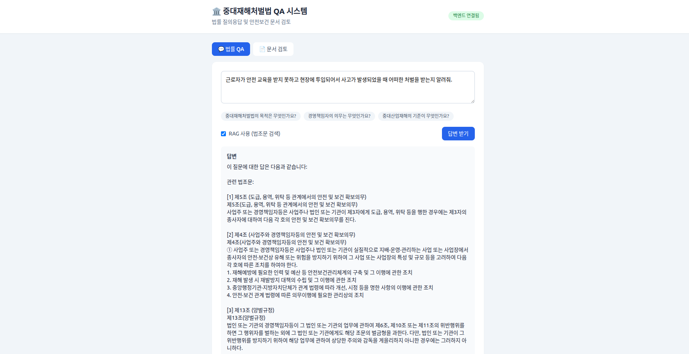

# 중대재해처벌법 QA 및 문서 검토 시스템

중대재해 처벌 등에 관한 법률에 대한 **질의응답**과 안전보건 문서 **자동 검토**를 제공하는 AI 시스템입니다.
한국어 LLM과 RAG(법조문 검색)를 결합하여 법조문에 근거한 답변을 생성합니다.

> 📖 상세 설계 문서는 [`docs/ARCHITECTURE.md`](docs/ARCHITECTURE.md)와 [`docs/UML.md`](docs/UML.md)를 참고하세요.



> 법률 QA 화면 — 질문을 입력하면 RAG로 검색한 법조문을 근거로 답변을 생성합니다.

---

## 주요 기능

### 1. 법률 QA (질의응답)
- 중대재해처벌법에 대한 자연어 질문에 답변
- LLM + RAG 하이브리드 방식 (선택적 LoRA 파인튜닝 지원)
- 관련 법조문 자동 검색 및 근거 인용

### 2. 문서 검토
- 안전보건 관련 문서를 4개 카테고리 체크리스트로 분석
- 중대재해처벌법 준수율 평가 및 미비점 도출
- 미비점에 대한 관련 법조문 연결 및 개선 권고

### 3. 지원 입력 형식
- 텍스트 직접 입력
- 파일 업로드: `TXT`, `DOCX`, `PDF`

---

## 기술 스택

| 영역 | 기술 |
|------|------|
| 백엔드 | Python 3.10 · FastAPI · uvicorn |
| 프론트엔드 | React 18 · TypeScript · Vite · Tailwind CSS |
| LLM | `Llama-3.2-Korean-GGACHI-1B-Instruct` (+ 선택적 LoRA / PEFT) |
| 임베딩 | `jhgan/ko-sroberta-multitask` (SentenceTransformers, 768차원) |
| 벡터 DB | ChromaDB (PersistentClient, 디스크 영속화) |
| 문서 처리 | python-docx · pypdf |
| 배포 | Docker · docker-compose (GPU 예약) |

---

## 프로젝트 구조

```
serious-accident-law-qa/
├── backend/                  # FastAPI 백엔드
│   ├── main.py               # 엔트리 — 앱 생성, lifespan 모델 로드, 라우터 등록
│   ├── routers/
│   │   ├── qa.py             # POST /api/qa
│   │   └── review.py         # POST /api/review/text|file
│   ├── schemas.py            # Pydantic 요청/응답 모델
│   ├── integrated_qa.py      # IntegratedQASystem — LLM + RAG 오케스트레이션
│   ├── rag_system.py         # LawRAGSystem(검색) + DocumentReviewer(문서 검토)
│   ├── file_utils.py         # 업로드 파일(txt/docx/pdf) 텍스트 추출
│   ├── data_collector.py     # 법령 데이터 / QA 데이터셋 생성
│   ├── finetune.py           # LoRA 파인튜닝 스크립트 (오프라인)
│   ├── requirements.txt      # Python 의존성
│   ├── Dockerfile            # 컨테이너 이미지 정의
│   ├── docker-compose.yml    # GPU 예약 포함 서비스 정의
│   ├── law_data.json         # 중대재해처벌법 조문 (없으면 자동 생성)
│   ├── qa_dataset.json       # 파인튜닝용 QA 데이터셋
│   ├── sample_documents/     # 검토 기능 테스트용 예시 문서
│   └── chroma_db/            # ChromaDB 벡터 인덱스 (자동 생성)
├── frontend/                 # React + Vite 프론트엔드
│   └── src/
│       ├── App.tsx           # 탭 전환, 헬스 체크, 레이아웃
│       ├── components/
│       │   ├── QaPanel.tsx   # 법률 QA UI
│       │   └── ReviewPanel.tsx  # 문서 검토 UI
│       └── api/client.ts     # 백엔드 API 클라이언트
└── docs/                     # 아키텍처 / UML 문서
```

---

## 빠른 시작

### 사전 요구사항
- Python 3.10
- Node.js 18.18+ (`< 19`)

### 1단계 — 백엔드 실행

```bash
cd backend
pip install -r requirements.txt
uvicorn main:app --port 8000
```

> 첫 실행 시 `law_data.json`이 없으면 자동 생성하고, ChromaDB 인덱스가 비어 있으면 조문을 인덱싱합니다.
> LLM·임베딩 모델 로딩에 수십 초가 소요될 수 있습니다.
>
> ⚠️ 모델 로딩이 무겁기 때문에 `--reload`는 권장하지 않습니다 (코드 변경 시마다 모델 재로딩).

### 2단계 — 프론트엔드 실행

```bash
cd frontend
npm install
npm run dev
```

### 3단계 — 접속

브라우저에서 **http://localhost:5173** 접속.

프론트엔드의 `/api/*` 요청은 Vite 프록시가 백엔드(`http://localhost:8000`)로 전달하므로
브라우저 입장에서 동일 출처이며 별도 CORS 설정이 필요 없습니다.

---

## API 엔드포인트

| 메서드 | 경로 | 설명 |
|--------|------|------|
| `POST` | `/api/qa` | 법률 질문에 RAG + LLM으로 답변 |
| `POST` | `/api/review/text` | 입력 텍스트 문서 검토 |
| `POST` | `/api/review/file` | 업로드 파일(txt/docx/pdf) 검토 |
| `GET`  | `/api/health` | 헬스 체크 — 모델 로드 여부 반환 |

대화형 API 문서는 백엔드 실행 후 http://localhost:8000/docs 에서 확인할 수 있습니다.

---

## 사용 방법

### 법률 QA
1. **💬 법률 QA** 탭 선택
2. 질문 입력 (예: `중대재해처벌법의 목적은 무엇인가요?`)
3. **RAG 사용** 체크박스로 법조문 검색 활성화/비활성화
4. **답변 받기** 클릭 → 답변 및 참고 법조문 확인

### 문서 검토
1. **📄 문서 검토** 탭 선택
2. **텍스트 입력** 또는 **파일 업로드** 모드 선택
3. 안전보건 문서 내용 입력 / 파일(TXT·DOCX·PDF) 업로드
4. **문서 검토** 클릭 → 준수율 리포트 확인

---

## 검토 결과 해석

### 전체 준수율
| 준수율 | 평가 |
|--------|------|
| 80% 이상 | ✅ 우수 |
| 60–80% | ⚠️ 보통 (개선 필요) |
| 60% 미만 | ❌ 미흡 (긴급 개선 필요) |

### 카테고리
1. **안전보건관리체계** — 인력, 예산, 체계 구축
2. **재해예방 대책** — 재발방지, 위험성 평가
3. **법령 준수** — 행정명령 이행, 관계 법령 준수
4. **도급/용역 관리** — 협력업체 안전관리

리포트에는 미비점 목록, 관련 법조문, 개선 권고사항이 함께 제공됩니다.

---

## 예시 질문

```
- 중대재해처벌법의 목적은 무엇인가요?
- 중대산업재해의 정의는?
- 경영책임자의 안전보건 확보 의무는?
- 처벌 수준은 어떻게 되나요?
- 도급 관계에서도 책임을 져야 하나요?
- 양벌규정이란 무엇인가요?
- 중대시민재해란?
```

---

## Fine-tuning (선택사항)

기본 모델 대신 도메인 특화 성능을 원한다면 LoRA 파인튜닝을 수행할 수 있습니다.

```bash
cd backend
python finetune.py
```

- 소요 시간: GPU 기준 1–2시간 (CPU도 가능하나 매우 느림)
- 권장 VRAM: 8GB 이상
- 학습된 어댑터는 `./finetuned_model/`에 저장되며, `IntegratedQASystem(use_finetuned=True)`로 로드됩니다.

| LoRA 설정       | 값           | 학습 설정              | 값    |
|-----------------|--------------|------------------------|-------|
| Rank (r)        | 16           | Epochs                 | 3     |
| Alpha           | 32           | Batch Size             | 2     |
| Dropout         | 0.05         | Gradient Accumulation  | 4     |
| Target Modules  | q/k/v/o_proj | Learning Rate          | 2e-4  |

> CUDA 환경에서는 4-bit 양자화(nf4)와 `paged_adamw_8bit` 옵티마이저를 사용하고,
> CPU 환경에서는 표준 `adamw_torch`로 자동 전환됩니다.

---

## Docker 실행

```bash
cd backend
docker-compose up --build
```

컨테이너는 FastAPI 백엔드(`uvicorn main:app`)를 `8000` 포트로 실행하며,
`docker-compose.yml`은 NVIDIA GPU 1개를 예약하고 데이터 파일·`chroma_db`·`finetuned_model`을 볼륨 마운트합니다.

---

## 시스템 요구사항

| 구분 | 최소 | 권장 |
|------|------|------|
| Python | 3.10 | 3.10 |
| RAM | 8GB | 16GB |
| GPU | 없음 (CPU 추론 가능) | 8GB+ VRAM |
| 저장공간 | 5GB | 10GB |

추론만 수행할 경우 GPU 없이 CPU에서도 동작하지만 속도가 느립니다.

---

## 트러블슈팅

**모델 로딩 실패** — 파인튜닝 모델이 없거나 손상된 경우, `IntegratedQASystem`은 자동으로 기본 모델로 폴백합니다. `main.py`는 기본적으로 `use_finetuned=False`로 실행됩니다.

**CUDA Out of Memory** — 파인튜닝 시 batch size를 줄이거나 gradient accumulation을 늘리세요. 4-bit 양자화는 CUDA 환경에서 자동 적용됩니다.

**ChromaDB 인덱스 초기화** — 인덱스를 재생성하려면:
```bash
cd backend
rm -rf chroma_db/
# 다음 백엔드 실행 시 자동 재인덱싱됨
```

**ModuleNotFoundError** — `cd backend && pip install -r requirements.txt`로 의존성을 다시 설치하세요.

---

## 면책조항

본 시스템의 답변은 **참고용**이며 법률 자문을 대체할 수 없습니다.
실제 법률 적용 시에는 반드시 전문가의 자문을 받으시기 바랍니다.
본 프로젝트는 교육 및 연구 목적으로 제작되었습니다.
