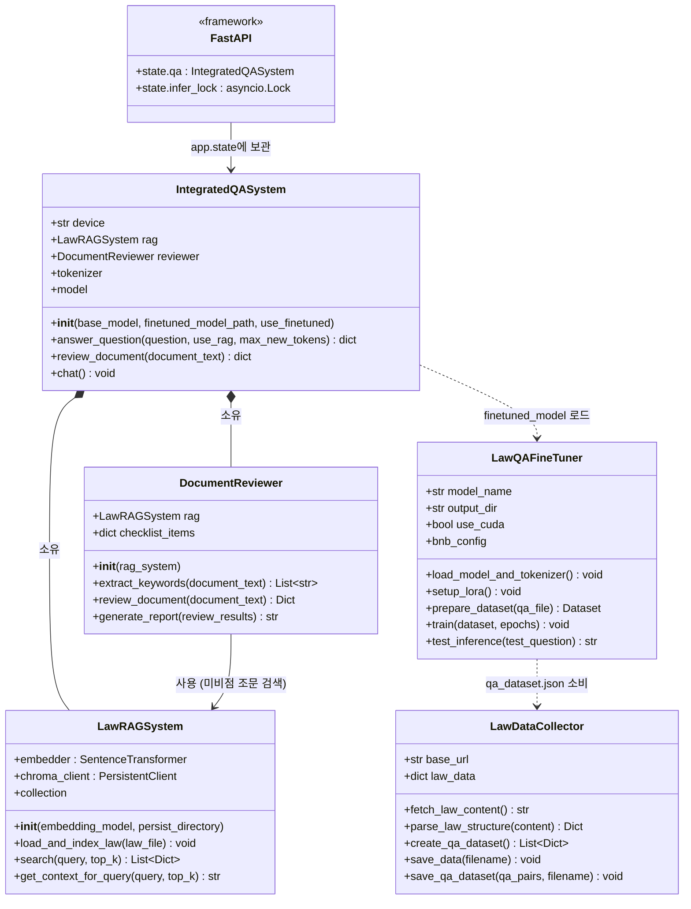
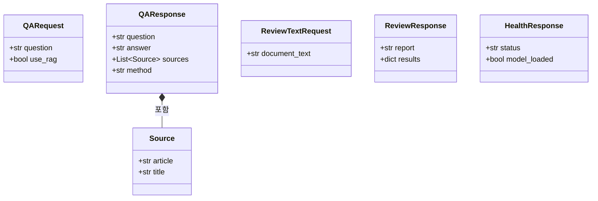
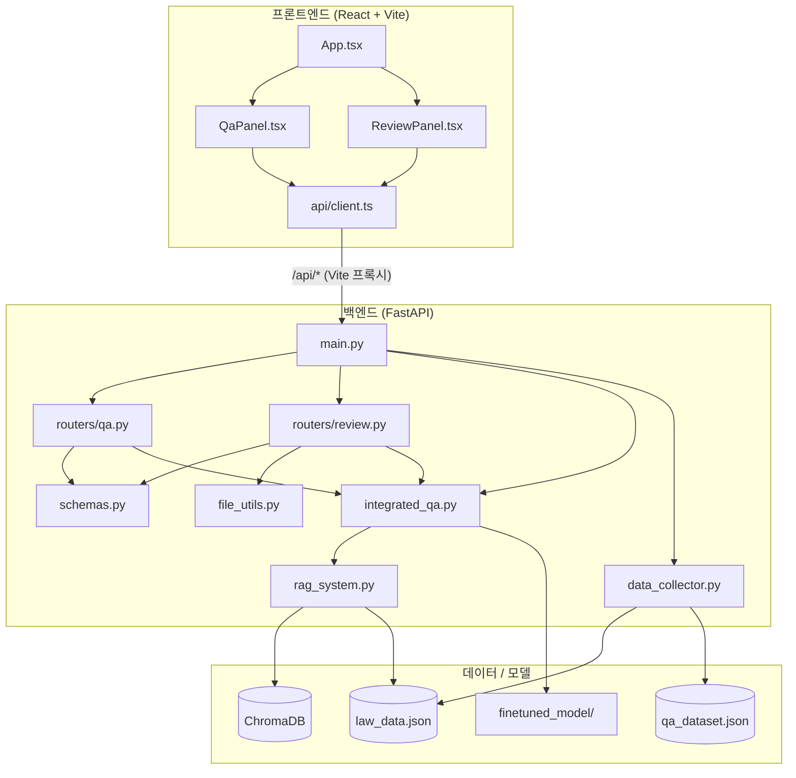
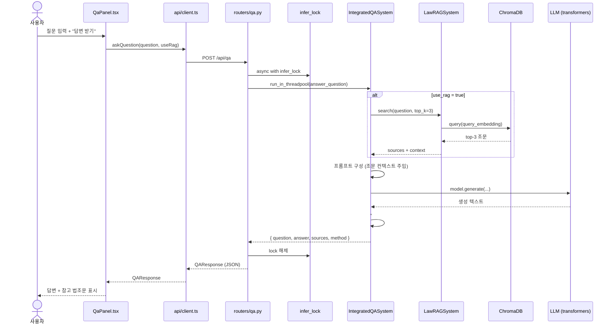
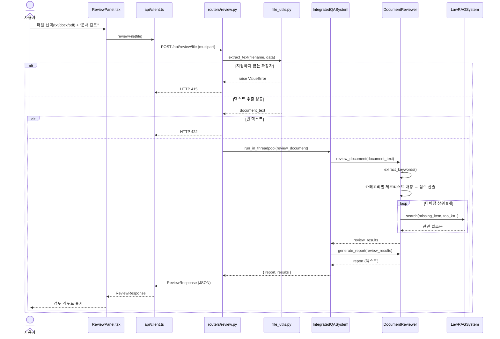
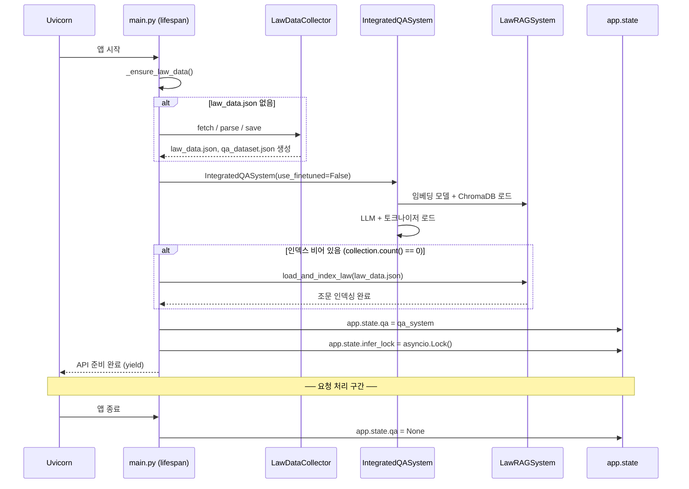
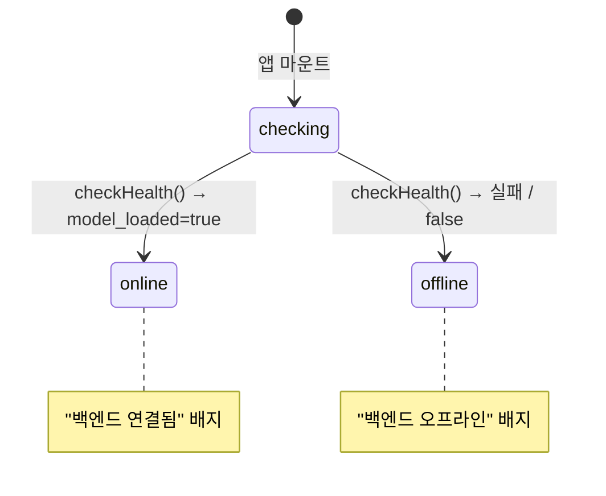
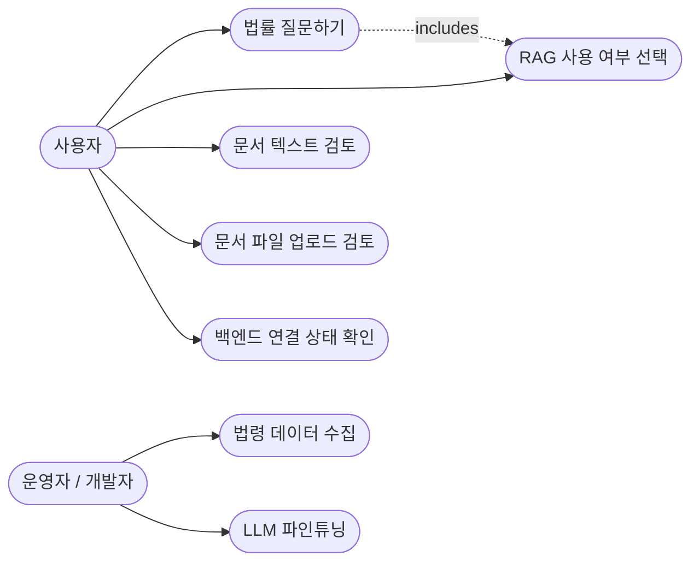

# UML 다이어그램 — 중대재해처벌법 QA 시스템

> 백엔드 핵심 클래스와 주요 시나리오를 UML로 표현한다.
> 다이어그램은 [Mermaid](https://mermaid.js.org/) 문법으로 작성되어 GitHub 등에서 렌더링된다.

---

## 1. 클래스 다이어그램

백엔드 도메인 클래스와 Pydantic 스키마의 구조 및 관계.

### 1.1 Pydantic 스키마 (schemas.py)

---

## 2. 컴포넌트 다이어그램

시스템의 모듈 단위 구성과 의존 방향.

---

## 3. 시퀀스 다이어그램 — 법률 QA

`POST /api/qa` 요청 처리 흐름.

---

## 4. 시퀀스 다이어그램 — 문서 검토 (파일 업로드)

`POST /api/review/file` 요청 처리 흐름.

---

## 5. 시퀀스 다이어그램 — 애플리케이션 시작 (lifespan)

백엔드 부트스트랩 시 모델·인덱스 초기화 흐름.

---

## 6. 상태 다이어그램 — 프론트엔드 헬스 상태

`App.tsx`의 백엔드 연결 상태 전이.

---

## 7. 유스케이스 다이어그램

